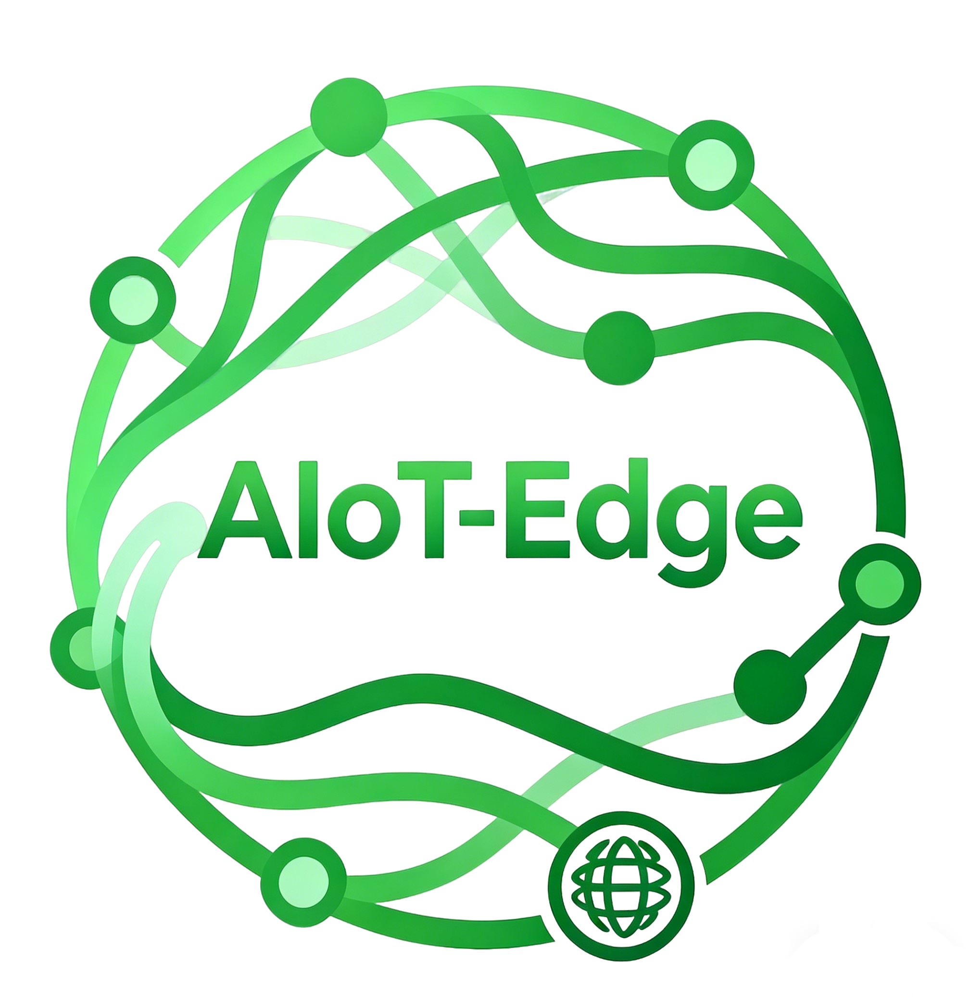
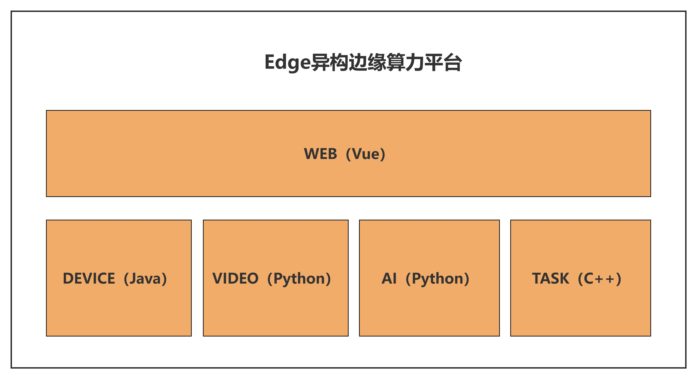
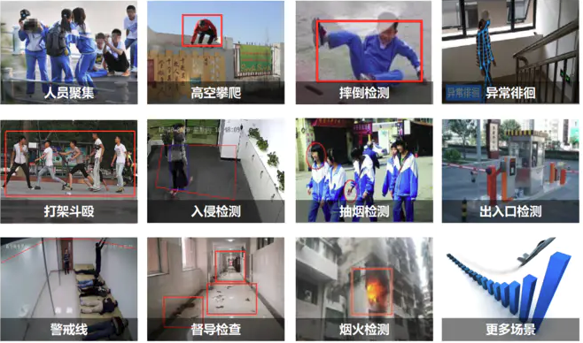
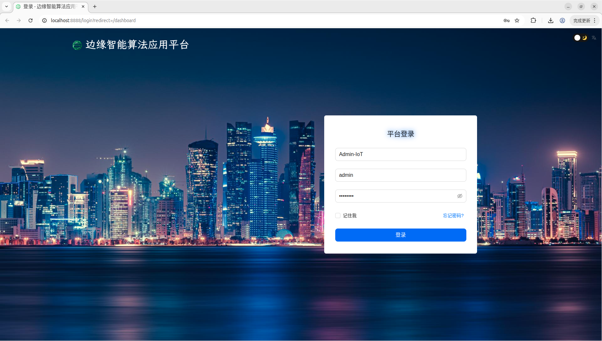
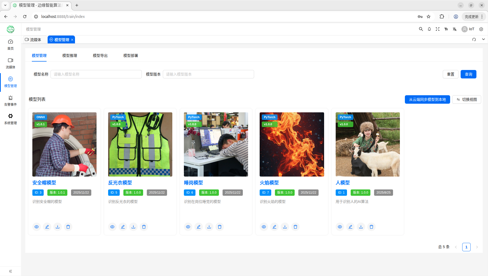
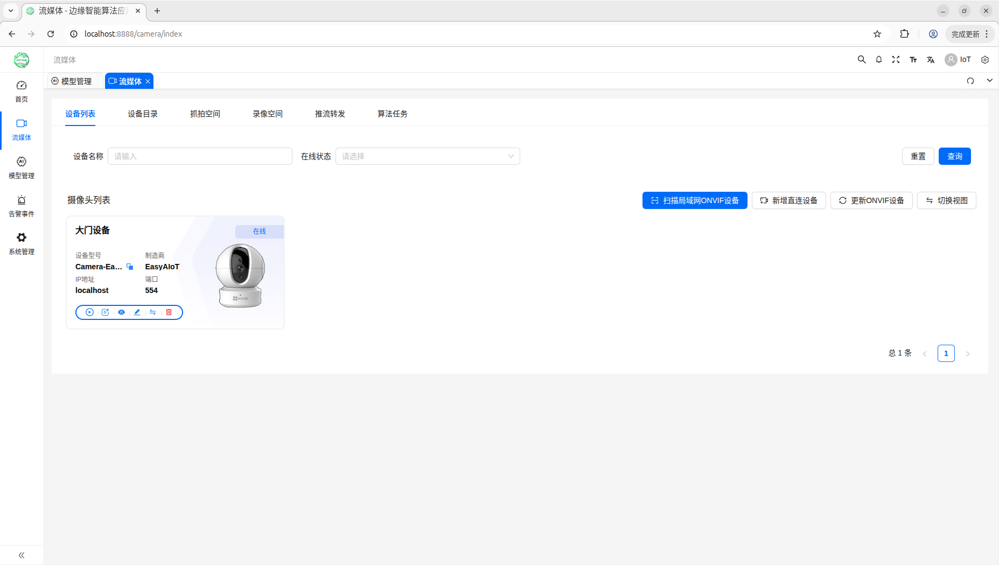
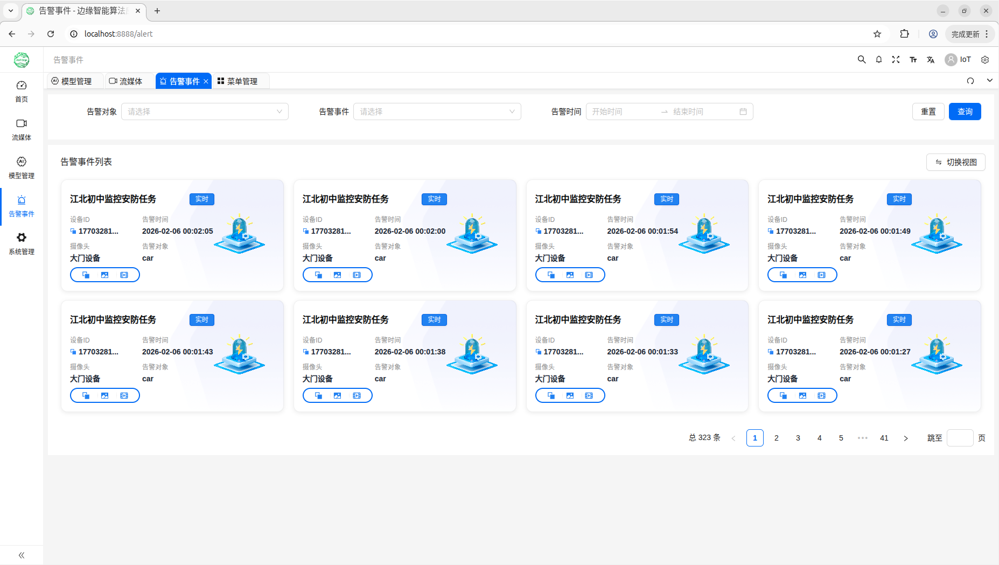

# EasyAIoT Edge (Heterogeneous Edge Computing Platform)

### One platform, covering mainstream edge computing power – switch the chip, not the business.

  EasyAIoT Edge is a fully open-source edge AI algorithm application platform. Under a unified set of operation habits, data links, and O&M systems, <strong>it simultaneously supports heterogeneous edge computing power such as Huawei Ascend, NVIDIA Jetson, Rockchip RK3588, Sophon BM1688, and Hygon/Intel/AMD x86</strong>. The platform covers the full chain of camera access, algorithm task orchestration, inference, alarming, recording, IoT acquisition, and rule engine. It adopts the MIT license, with no risk of vendor lock-in.

  

<h4 align="center" style="display: flex; justify-content: center; gap: 20px; flex-wrap: wrap; padding: 20px; font-weight: bold;">
  <a href="./README.md">English</a>
  |
  <a href="./README_zh.md">简体中文</a>
</h4>

## 💎 Why It's Worth Your Attention

| Your Concern | Explanation |
|--------------|-------------|
| **Less redundant work** | The field may involve Xinchuang Ascend, industrial Jetson, cost-effective RK3588, high-compute BM1688, or server-room x86. The business logic and interface are unified – no need to build a separate backend and O&M manual for each board. |
| **Reduced learning and integration cost** | O&M and integration teams only need to get familiar with one set of modules (WEB / DEVICE / VIDEO / AI / TASK) and one port topology. Changing hardware mainly means swapping inference images and parameters, not rebuilding the system from scratch. |
| **Edge can self-close the loop** | Local alarming and recording are possible even in weak or private networks. The core link can run with approximately <strong>4GB</strong> of memory, making it suitable for boxes, all-in-one machines, and small servers. |
| **Compliance and business friendly** | MIT license – individuals and enterprises can freely use and customize without anxiety about vendor lock-in. |

## 🎯 Why "One Platform, Multiple Chips"

The biggest pain point in edge deployment is often not "no model", but **changing a board requires changing a whole system**: domestication requires Ascend and Hygon x86, Jetson is common on production lines, RK3588 is used for low-cost solutions, and BM1688 is typical for heavy-inference boxes – each with different SDKs, containers, and inference entry points. The same security or quality inspection business is forced to maintain multiple technical lines, consuming manpower and time on repetitive integration.

**EasyAIoT Edge** uses fixed five modules – **WEB / DEVICE / VIDEO / AI / TASK** – along with **fixed ports + environment variables + host network** to separate the "daily-use platform" from the "chip-bound inference part": the interface, alarming, recording, thing model, and rule engine remain unchanged; switching among Ascend, Jetson, RK, BM1688, or x86 mainly involves changing the inference image, orchestration parameters, and the build target of TASK (C++), aligning with common routes like CANN, CUDA/TensorRT, RK NPU, TPU, and x86 CPU/GPU, thereby using **a single open-source platform** to string together Xinchuang, industrial control, ARM boxes, and x86 servers.

## 🧩 Supported Chips and Typical Usage

| Chip / Platform | Typical Hardware / Scenario | Role in This Platform |
|-----------------|-----------------------------|-----------------------|
| **Huawei Ascend** | Atlas edge inference cards, Ascend NPU all-in-one machines, etc. | Xinchuang and domestic inference stack; closed-loop business together with DEVICE / alarming / recording |
| **NVIDIA Jetson** | Orin / Xavier / Nano, etc. | Industrial vision, low-latency CUDA ecosystem; supports containerized GPU / NVIDIA toolchain integration |
| **Rockchip RK3588** | ARM edge all-in-one machines, NVR form factor | High-efficiency ARM + NPU; suitable for multi-channel video and lightweight inference combinations |
| **Sophon BM1688** | Sophon edge computing box, 1688 series SoC | High-compute INT8/TPU route; suitable for heavy inference or model service clusters |
| **x86 (Hygon / Intel / AMD)** | Rack-mounted edge servers, industrial PCs | General-purpose CPU and optional discrete GPU; suitable for centralized multi-channel, rule engine and storage |

> For specific images, driver versions, and inference backends of each chip, please refer to [.doc/deployment/edge_platform_deployment_en.md](.doc/部署文档/边缘平台部署文档_zh.md); for **ARM (including RK3588) and others**, the corresponding inference stack images need to be selected or built according to device capabilities, decoupled from platform modules.

## 📍 Project Positioning

**EasyAIoT Edge** is an **independent sub-project** of the main EasyAIoT project, targeting edge scenarios. Under the premise of "one software adapting to multiple mainstream chips," it is a tailored and strengthened one-stop intelligent algorithm stack for sites with resource constraints and unstable networks (parks, factories, server rooms, ARM/x86 all-in-one machines).

The platform continues the cloud-edge-device integration concept of the main project, but the **default configuration, service composition, and deployment topology** are all oriented towards **single-machine / small number of nodes**: video access, algorithm scheduling, inference, and alarming default to **local closed-loop**, the core link can run with approximately **4GB** of memory, and it can collaborate with the cloud EasyAIoT **edge-cloud synergy**, or **run completely offline independently**.

## 🧠 AI Capabilities

| Capability | Description |
|------------|-------------|
| **Multi-protocol camera access** | Supports both ONVIF and RTSP protocols, auto-discovery, unified management |
| **Real-time stream AI analysis** | RTSP/RTMP real-time video analysis, millisecond-level response, supports multi-channel concurrency |
| **Snapshot algorithm tasks** | Intelligent recognition of captured images, suitable for event review and image retrieval |
| **Model service cluster inference** | Lightweight model service, supports load balancing and high availability (single machine with multiple instances) |
| **Arming schedule management** | Full arming / partial arming modes, flexible configuration of time-based monitoring rules |
| **Detection area drawing** | Visual drawing of quadrilateral/polygon detection areas, associated with algorithm models |
| **Intelligent linked alarm** | Triple filtering of detection area + arming schedule + event type, significantly reducing false alarms |
| **Alarm recording and playback** | Alarm-triggered automatic recording, supports timeline playback and variable speed playback |

## 🔌 IoT Edge Acquisition Capabilities

The platform uses **Node-RED** as the **IoT acquisition and protocol gateway** at the edge: on all-in-one machines or field gateways, visual flows connect complex industrial devices such as PLC, Modbus, OPC UA to complete acquisition, cleaning, and standardized reporting, forming a multi-source data closed-loop with DEVICE thing models, rule engines, and upstream AI/alarming.

| Feature | Description |
|---------|-------------|
| **Visual low-code orchestration** | Drag, drop and wire nodes to build acquisition and forwarding logic, aligned with the habits of electrical and process engineers, significantly reducing hard coding and on-site customization cycles |
| **Industrial multi-protocol and complex addressing** | Covers typical field protocols such as PLC, Modbus (RTU/TCP), OPC UA, serial/Ethernet, supports registers, tags, node addresses and other common industrial control models |
| **Edge proximity processing** | Perform parsing, buffering, and lightweight computation at the edge, reducing upstream bandwidth and cloud dependency; local acquisition and basic closed-loop can be maintained even in weak or private networks |
| **Polling and event dual mode** | Cyclic polling and change/alarm triggering can coexist, accommodating both steady-state conditions and sudden anomalies, in line with SCADA/industrial control usage habits |
| **Cleaning and thing model alignment** | Use Function, JSON, template nodes to complete unit conversion, invalid value filtering, and field mapping, outputting data that meets the platform's thing model and upstream specifications |
| **Ecosystem expansion and private protocols** | Rely on community nodes and self-developed nodes to quickly supplement vendor protocols or third-party gateways, avoiding the repetitive investment of "changing a backend for every type of device" |
| **Platform business linkage** | Connect to the DEVICE module via MQTT, HTTP, etc., data enters the rule engine and alarm chain, and can be linked with video and AI detection tasks for multi-source linkage and policy orchestration |
| **Operable and traceable** | Flow supports import/export and version retention, built-in debugging and message tracking, facilitating troubleshooting, auditing, and multi-site configuration replication |

## 💡 Technical Philosophy

We adhere to a **Java + Python + C++** multi-language hybrid architecture, leveraging the strengths of each:

- **Java**: Builds a stable and reliable platform with enterprise-level capabilities
- **Python**: Streaming media processing, AI algorithm orchestration, model services
- **C++**: High-performance inference hot path (TASK), low latency, low memory footprint; under the same scheduling logic, inference acceleration can be tailored for different chips

In edge scenarios, modules connect directly through **environment variables + fixed ports + host network**, without relying on centralized registration discovery, reducing O&M costs; **switch the chip, not the business** – the management end and DEVICE/VIDEO protocol layer remain stable, the inference layer switches based on chip.

## 🔗 Relationship with the Main Project EasyAIoT

| Dimension | Edge Sub-Project Focus |
|-----------|------------------------|
| **Product form** | Edge device first, image and service composition orchestrated for all-in-one machine/box scenarios |
| **Memory and resources** | **4GB-level target** (streamlined service set + adjustable JVM/Worker/inference parameters) |
| **Deployment topology** | Single machine or a few nodes, middleware and business directly connected, no multi-tenancy |
| **Service discovery** | Fixed ports + environment variables, **does not rely on** centralized registry |
| **Network** | Video service defaults to `network_mode: host`, convenient for communication with cameras/LAN |
| **Database** | Default database names `ruoyi-vue-pro20` / `iot-edge-video20` / `iot-edge-ai20` |
| **Computing power** | **Ascend / Jetson / RK3588 / BM1688 / x86** etc.: TASK (C++) + AI containers orchestrated per target chip; can reference official container solutions like NVIDIA Container Toolkit |
| **Edge-cloud synergy** | Can connect to the cloud main project to achieve strategy/model/alarm synchronization, or run completely offline |

> If you need centralized O&M for thousands of channels or multi-tenant operation dashboards, please use the main project's cloud deployment solution.

## 🧩 Project Structure

EasyAIoT Edge consists of five core modules, which can be deployed independently:

| Module | Description |
|--------|-------------|
| **WEB** | Vue 3 + Vite management frontend: cameras, algorithm tasks, models, alarms, permissions, etc. |
| **DEVICE** | IoT device/product/thing model/rule engine backend (JDK 21) |
| **VIDEO** | Video and algorithm task Python service (including frame extractor, sorter, streaming, etc.) |
| **AI** | Training, inference, model services (YOLO/LLM/OCR/speech, etc.) |
| **TASK** | C++ high-performance edge inference module |

## 🏗️ Architecture and Data Flow

Brief data flow:
1. Cameras connect to the VIDEO module via ONVIF/GB28181
2. VIDEO extracts video frames based on algorithm task configuration and distributes them to the AI module or TASK module
3. AI/TASK performs inference and returns the results to VIDEO
4. VIDEO triggers alarms based on arming rules and writes to the DEVICE module's rule engine
5. DEVICE sends alarms through notification channels and triggers recording storage
6. The WEB frontend uniformly displays device status, alarm events, and recording playback

## 🖥️ Localization and Operating Systems

| Category | Support Status |
|----------|----------------|
| **Memory specification** | Approximately 4GB and above (tunable as needed; recommended as default reference configuration) |
| **Operating systems** | Kylin, UOS, NFS China and other domestic Linux distributions, as well as mainstream Linux distributions |

## 📚 Deployment Documentation

- [Edge Platform Deployment Documentation](.doc/部署文档/边缘平台部署文档_zh.md)

## ⚙️ Project Address

- Gitee: https://gitee.com/volara/easyaiot-edge
- Github: https://github.com/soaring-xiongkulu/easyaiot-edge

## ☁️ Cross-Platform Deployment Advantages

EasyAIoT Edge supports deployment on three major platforms: Linux / Mac / Windows (Linux recommended for production environments):

  

    <h4>🐧 Linux</h4>
    <ul style="font-size: 14px;"><li>Preferred for production, low resource usage</li><li>Docker one-click startup</li><li>Perfectly adapted for ARM/x86 and various NPU/GPU edge forms</li></ul>
  

  

    <h4>🍎 Mac</h4>
    <ul style="font-size: 14px;"><li>Convenient for development and testing</li><li>Supports local debugging</li><li>Provides Homebrew scripts</li></ul>
  

  

    <h4>🪟 Windows</h4>
    <ul style="font-size: 14px;"><li>Windows Server friendly</li><li>PowerShell automation</li><li>Reduces learning cost</li></ul>
  

## 🎯 Applicable Scenarios

- 🏭 **Park/Factory security and production line visual inspection all-in-one machine** (Jetson / x86 / domestic hybrid environment)
- 📶 **Localized alarm and recording retention in weak or private network environments**
- 🔄 **Edge-side model closed-loop**: Acquisition → Annotation → Training → Deployment Inference
- ☁️ **Edge-cloud synergy with EasyAIoT**: Bidirectional synchronization of strategies, models, and alarms
- 🇨🇳 **Xinchuang and multiple chips in the same server room**: Unified management of Ascend + Hygon x86, etc. with video and IoT

## 📸 Interface Preview

  
  

  
  

## 📞 Contact (After adding WeChat, follow the official account to be invited to the technical exchange group)

  

## 👥 Official Account

  

## 🪐 Knowledge Planet

  

## 💰 Sponsorship / Donation

    
    

## 🤝 Contribution Guide

We welcome all forms of contributions! Whether you are a code developer, documentation writer, or issue reporter, your contribution will help make EasyAIoT better. Below are several main ways to contribute:

<h4 style="margin-top: 0; color: white; font-size: 18px;">💻 Code Contribution</h4>
<ul style="font-size: 14px; line-height: 1.8; margin: 10px 0; padding-left: 20px;">
  <li>Fork the project to your GitHub/Gitee account</li>
  <li>Create a feature branch (git checkout -b feature/AmazingFeature)</li>
  <li>Commit your changes (git commit -m 'Add some AmazingFeature')</li>
  <li>Push to the branch (git push origin feature/AmazingFeature)</li>
  <li>Submit a Pull Request</li>
</ul>

<h4 style="margin-top: 0; color: white; font-size: 18px;">📚 Documentation Contribution</h4>
<ul style="font-size: 14px; line-height: 1.8; margin: 10px 0; padding-left: 20px;">
  <li>Improve existing documentation content</li>
  <li>Supplement usage examples and best practices</li>
  <li>Provide multi-language translations</li>
  <li>Fix documentation errors</li>
</ul>

<h4 style="margin-top: 0; color: white; font-size: 18px;">🌟 Other Ways to Contribute</h4>
<ul style="font-size: 14px; line-height: 1.8; margin: 10px 0; padding-left: 20px;">
  <li>Report and fix bugs</li>
  <li>Suggest feature improvements</li>
  <li>Participate in community discussions and help other developers</li>
  <li>Share usage experience and cases</li>
</ul>

## 💡 Expectations

We welcome better suggestions to help improve easyaiot-edge; we also welcome supplements of best practices and image descriptions under various chips, so that "one platform, multiple chips" can truly be implemented on every production line.

## 📄 License

Soaring Xiongkulu/easyaiot-edge is open-sourced under the <a href="https://gitee.com/soaring-xiongkulu/easyaiot-edge/blob/main/LICENSE" style="color: #3498db; text-decoration: none; font-weight: 600;">MIT LICENSE</a>. We are committed to promoting the popularization and development of AI technology, allowing more people to freely use and benefit from this technology.

<strong>Usage Permission</strong>: Individuals and enterprises can use it 100% free of charge, without needing to retain author or Copyright information. We believe that the value of technology lies in being widely used and continuously innovated, rather than being bound by copyright. We hope you can freely use, modify, and distribute this project, so that AI technology truly benefits everyone.

